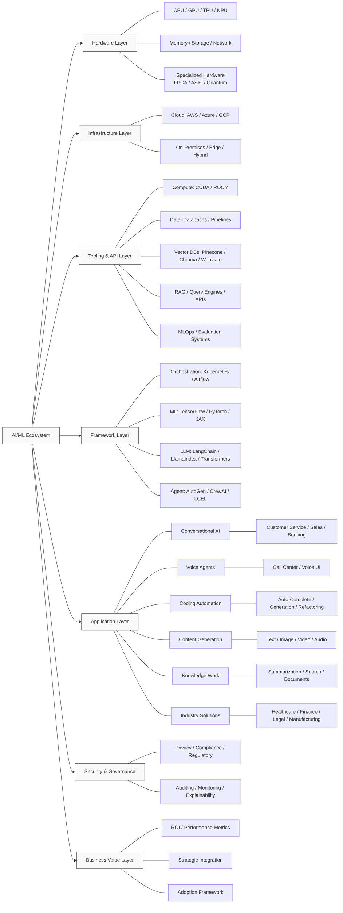

# AI Landscape

```mermaid
graph LR
    %% Main Categories
    AI[AI/ML Ecosystem] --> HW[Hardware Layer]
    AI --> INFRA[Infrastructure Layer]
    AI --> TOOL[Tooling & API Layer]
    AI --> FW[Framework Layer]
    AI --> APP[Application Layer]
    AI --> SEC[Security & Governance]
    AI --> BUS[Business Value Layer]

    %% Hardware Layer
    HW --- HW1[CPU / GPU / TPU / NPU]
    HW --- HW2[Memory / Storage / Network]
    HW --- HW3[Specialized Hardware<br>FPGA / ASIC / Quantum]

    %% Infrastructure Layer
    INFRA --- INFRA1[Cloud: AWS / Azure / GCP]
    INFRA --- INFRA2[On-Premises / Edge / Hybrid]

    %% Tooling & API Layer
    TOOL --- TOOL1[Compute: CUDA / ROCm]
    TOOL --- TOOL2[Data: Databases / Pipelines]
    TOOL --- TOOL3[Vector DBs: Pinecone / Chroma / Weaviate]
    TOOL --- TOOL4[RAG / Query Engines / APIs]
    TOOL --- TOOL5[MLOps / Evaluation Systems]

    %% Framework Layer
    FW --- FW1[Orchestration: Kubernetes / Airflow]
    FW --- FW2[ML: TensorFlow / PyTorch / JAX]
    FW --- FW3[LLM: LangChain / LlamaIndex / Transformers]
    FW --- FW4[Agent: AutoGen / CrewAI / LCEL]

    %% Application Layer
    APP --- APP1[Conversational AI]
    APP1 --- APP1_1[Customer Service / Sales / Booking]
    APP --- APP2[Voice Agents]
    APP2 --- APP2_1[Call Center / Voice UI]
    APP --- APP3[Coding Automation]
    APP3 --- APP3_1[Auto-Complete / Generation / Refactoring]
    APP --- APP4[Content Generation]
    APP4 --- APP4_1[Text / Image / Video / Audio]
    APP --- APP5[Knowledge Work]
    APP5 --- APP5_1[Summarization / Search / Documents]
    APP --- APP6[Industry Solutions]
    APP6 --- APP6_1[Healthcare / Finance / Legal / Manufacturing]

    %% Security & Governance
    SEC --- SEC1[Privacy / Compliance / Regulatory]
    SEC --- SEC2[Auditing / Monitoring / Explainability]

    %% Business Value Layer
    BUS --- BUS1[ROI / Performance Metrics]
    BUS --- BUS2[Strategic Integration]
    BUS --- BUS3[Adoption Framework]

    classDef layer fill:#f9f9f9,stroke:#333,stroke-width:1px;
    class AI,HW,INFRA,TOOL,FW,APP,SEC,BUS layer;
```
